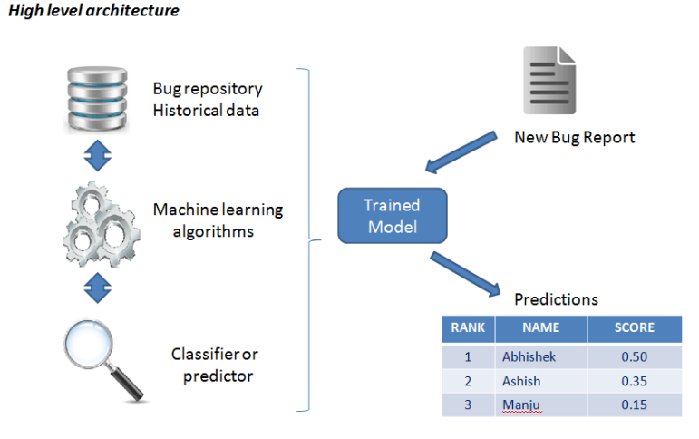
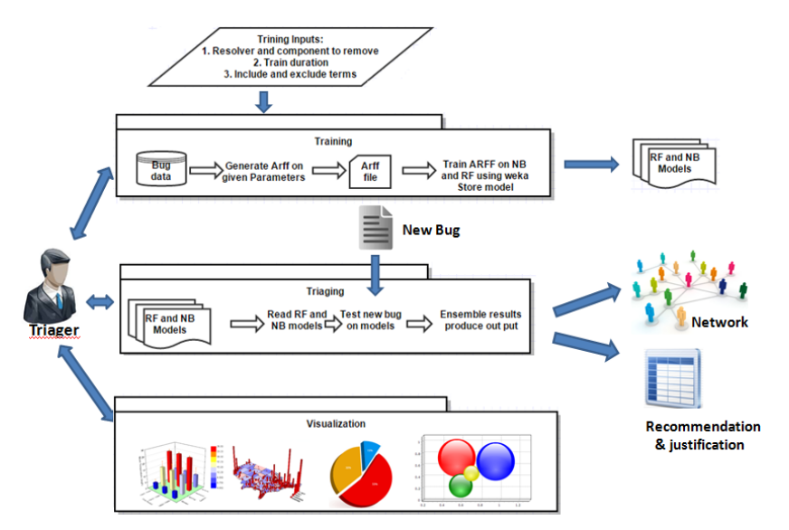
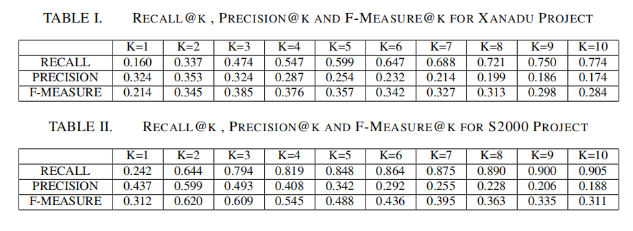

# Automatic-Bug-Triaging
Automatic bug triaging is a research prototype, a decision support platform for guiding a bug triager for resolver  recommendation using textual and non textual features. This automates the bug triaging. It involves machine learning, data mining,  data science, visualization and information retrieval concepts.

## Introduction
Bug report assignment to a bug fixer or resolver is
an important bug triaging activity. Bug assignment is a manual,
time-consuming and tedious task. Research shows that manual
bug assignment is often error-prone resulting in reassignments
and bug tossing (an issue in both open-source and proprietary
source projects). In this paper, we describe a decision support
platform for guiding a bug triager for resolver recommendation.
We design the decision support framework based on inputs from
practitioners who are part of change control board or bug council
of various product lines within a large engineering company. The
novel aspects of our work in-context to existing work on automatic
bug assignment is the application of non-textual features (in addition to the textual features consisting of terms in the bug reports)
such as the software component, work-load of resolvers, role (such
as triager, tester, product manager, test lead and developer) of a
team-member within the life-cycle of a bug and the collaborationnetwork between the team members. The decision support system
provides justification or reasoning, ranking and confidence score
for every bug-report recommendation. We conduct experiments
to evaluate the performance of our approach and share our
deployment experience, insights and learning

## High Level Architecture

## Implementation level Architecture

## Model Accuracy and Efficiency measures

## References

- [1] G. Bortis and A. v. d. Hoek, “Porchlight: A tag-based approach to
bug triaging,” in Proceedings of the 2013 International Conference on
Software Engineering, ICSE ’13, pp. 342–351, 2013.
- [2] X. Xia, D. Lo, X. Wang, and B. Zhou, “Accurate developer recommen�dation for bug resolution,” in Reverse Engineering (WCRE), 2013 20th
Working Conference on, pp. 72–81, 2013.
- [3] X. Xie, W. Zhang, Y. Yang, and Q. Wang, “Dretom: Developer recom�mendation based on topic models for bug resolution,” in Proceedings
of the 8th International Conference on Predictive Models in Software
Engineering, PROMISE ’12, pp. 19–28, 2012.
- [4] W. Wu, W. Zhang, Y. Yang, and Q. Wang, “Drex: Developer recommen�dation with k-nearest-neighbor search and expertise ranking,” in Software
Engineering Conference (APSEC), 2011 18th Asia Pacific, pp. 389–396,2011.
- [5] A. Tamrawi, T. T. Nguyen, J. M. Al-Kofahi, and T. N. Nguyen, “Fuzzy
set and cache-based approach for bug triaging,” in Proceedings of the
19th ACM SIGSOFT Symposium and the 13th European Conference on
Foundations of Software Engineering, pp. 365–375, 2011.
- [6] C. Francalanci and F. Merlo, “Empirical analysis of the bug fixing process
in open source projects,” in Open Source Development, Communities and
Quality, pp. 187–196, 2008.
- [7] E. Shihab, A. Ihara, Y. Kamei, W. Ibrahim, M. Ohira, B. Adams, A. Hassan, and  K.-i. Matsumoto, “Studying re-opened bugs in open
source software,” in Empirical Software Engineering, pp. 1005–1042,
2013

## Developer Info
- Manjunath C Bagewadi
- Email : manjunathsept11@gmail.com
- Ph: 9742896702
- Linked In : linkedin.com/in/manjunath-bagewadi-9325ab55
 	
 	
 	
 